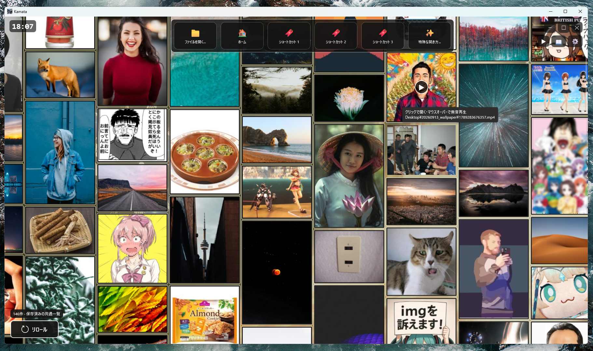
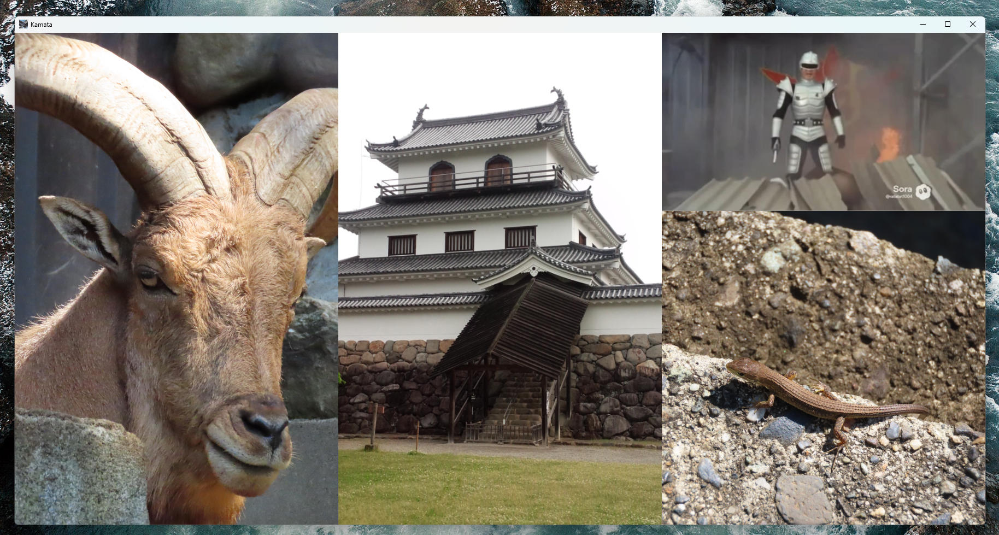
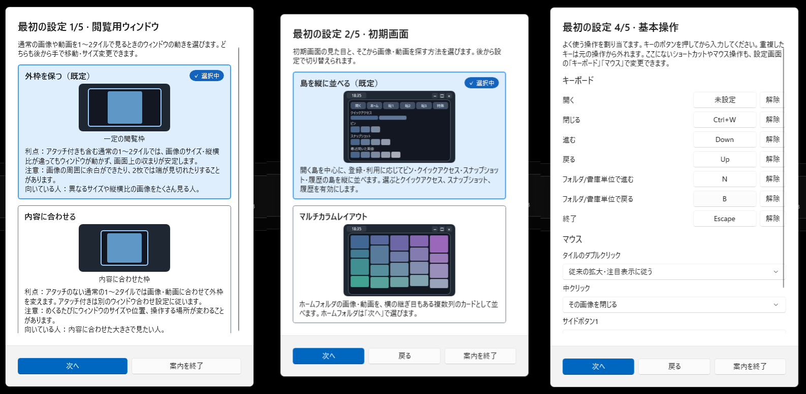

# Kamata

**Kamata** は、画像や動画を探し、複数のタイルに並べて楽しめる Windows 用ビューアーです。フォルダを一枚ずつたどるだけでなく、初期画面をギャラリーとして眺めたり、画像と動画を同じタイルに組み合わせたりできます。

**[→ 最新版をダウンロード](https://github.com/victorycats/app-kamata/releases/latest)**

## このアプリでできること

### フォルダの画像・動画を、眺めながら選ぶ

初期画面の**マルチカラムレイアウト**では、指定したフォルダの画像と動画を画面いっぱいに並べます。気になるものをクリックして開き、閉じると見ていた並びへ戻れます。ホイールで縦にスクロール、右ドラッグで上下左右に移動できます。動画はマウスを重ねると無音でプレビューできます。通常の、背景と開くボタンなどを並べた初期画面も選べます。

### 複数のタイルで見比べる

画像や動画を複数のタイルに開いて、並べて見比べられます。それぞれを個別にめくるほか、まとめてめくることもできます。タイル間の境界をドラッグすれば、見たい画像に合わせて幅を調整できます。下部のスクラバーパネルからは、同じフォルダの画像をサムネイルで探せます。

### 画像と動画を、ひとつのタイルに

タイルの上下端へ異なる種類のファイルをドラッグ＆ドロップすると、画像と動画をひとつのタイルに組み合わせられます。境界をドラッグして表示の高さを変えたり、片側だけを閉じたりできます。複数の画像を並べたまま、そのうち一枚に動画を添える使い方もできます。画像同士・動画同士のアタッチには対応していません。

### 最初の設定から、自分に合う使い方を選ぶ

初回起動時には、ウィンドウの表示方式、初期画面、開く枚数、基本操作、タイル端へのドラッグ＆ドロップなどを図と説明から選べます。主な操作や表示は後から設定画面で変更できます。

## 対応形式

| 種類 | 形式 |
| --- | --- |
| 画像 | JPEG（`.jpg` `.jpeg` `.jfif`）、PNG（`.png` `.apng`）、GIF、BMP、WebP、TIFF（`.tif` `.tiff`）、HEIC / HEIF、AVIF |
| 動画 | `.mp4` `.avi` `.webm` |
| 音声 | `.mp3` `.wav` `.wave` |
| 書庫内の画像 | `.zip` `.cbz` `.rar` `.cbr` `.7z` |
| 文書 | `.pdf`（ページを画像として表示） |

GIF・WebP・APNGのアニメーションにも対応しています。動画の再生可否は、ファイル内の映像・音声コーデックと Windows の再生環境にも左右されます。

## 動作環境

- Windows 10（バージョン 1809 以降）/ Windows 11 の **x64** 環境。

配布ファイルは次の2種類です。初めて使う場合は**通常版（ランタイム同梱）**を選んでください。

| 種類 | 必要な準備 |
| --- | --- |
| 通常版（ランタイム同梱） | .NET と Windows App SDK の実行環境を同梱。追加のランタイム導入なしで使えます。 |
| 軽量版（ランタイム別途） | ダウンロードは小さくなりますが、起動前に下記のランタイムを導入する必要があります。 |

軽量版の現行ビルド（v1.114.3）で必要なもの：

1. **[.NET 8 Runtime（Windows x64）](https://dotnet.microsoft.com/download/dotnet/8.0)**。`.NET Desktop Runtime 8` を既に導入している場合も利用できます。.NET SDKの導入は不要です。
2. **[Windows App SDK Runtime 2.3.1（x64）](https://learn.microsoft.com/windows/apps/windows-app-sdk/downloads)**。ダウンロードページで「2.3.1」の「Installer (x64)」を選び、実行してください。SDKの開発ツールではなく、実行用ランタイムのインストーラーです。

Windows App SDK Runtime の導入には [Microsoft Visual C++ 再頒布可能パッケージ（x64）](https://learn.microsoft.com/cpp/windows/latest-supported-vc-redist) も必要です。未導入の場合は、こちらもインストールしてください。既に必要なランタイムが入っている場合、再インストールする必要はありません。

## インストール方法

1. [Releases](https://github.com/victorycats/app-kamata/releases) から、**通常版（ランタイム同梱）**または**軽量版（ファイル名に `runtime-required` を含むもの）**のZIPを選びます。
2. 通常版はZIPから `Kamata.exe` を取り出し、任意のフォルダに置いて起動します。軽量版は上記のランタイムを導入してから、**ZIPの中身をすべて同じフォルダへ展開**し、その中の `Kamata.exe` を起動します。軽量版ではEXEだけを取り出しても動きません。
3. 初回の案内に従い、表示方式や画像フォルダを設定します。

更新する場合はKamataを終了してから、通常版は `Kamata.exe` を、軽量版は展開したファイル一式を新しい版へ入れ替えてください。2種類のファイルを同じフォルダに混ぜないでください。設定やキャッシュはユーザーのアプリデータ領域に保存されます。

## 不具合報告について

[Issues](https://github.com/victorycats/app-kamata/issues) でお知らせください。アプリの設定画面にある**「このアプリについて」→「不具合を報告する」**を使うと、バージョンや環境情報を含む報告文をコピーして報告ページを開けます。発生手順、期待した動作、実際の動作も添えてください。

強制終了やフリーズの場合は、同じ画面の**「レポートとログをまとめて保存(zip)」**で作成したファイルが調査に役立ちます。公開前に、添付内容に個人情報や公開したくないファイルパスがないか確認してください。

## ソースコードについて

現在、ソースコードは公開していません。このリポジトリでは、アプリの配布と案内、不具合報告の受付を行います。
